**Test**

- The following output shows that the module passes the unit tests

**SV Files**

- This is a 4 bit linear shift feedback register
- The primitive polynomial is 1 + X^3 + X^4

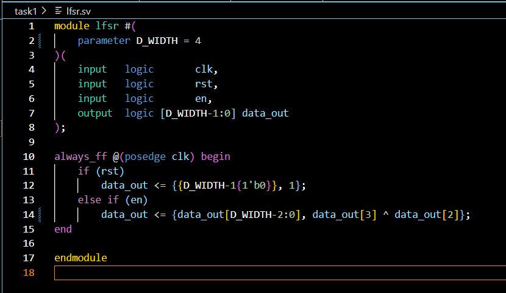

- the verify file is as such
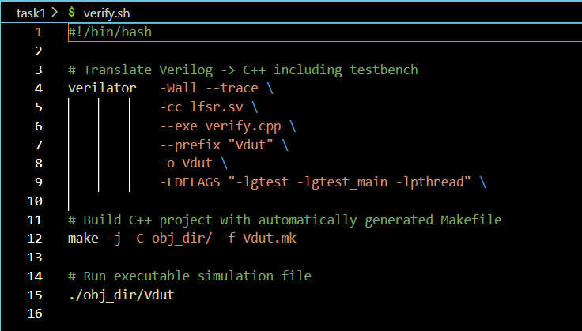

- The passed messages for the follwing unit tests (using GTest)

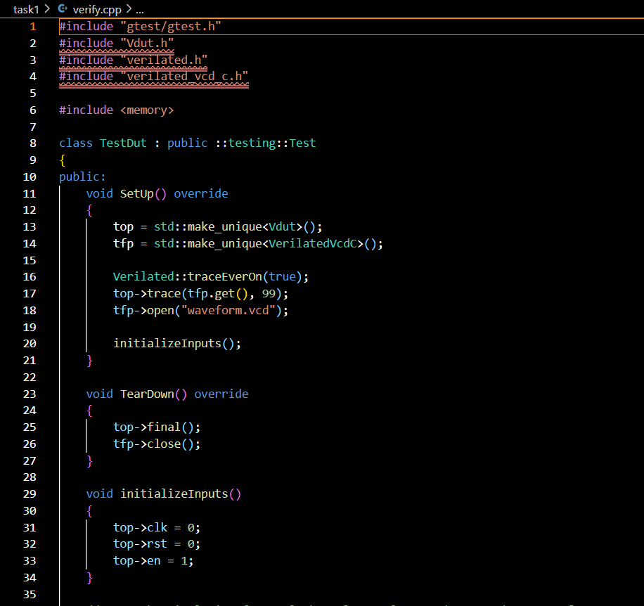
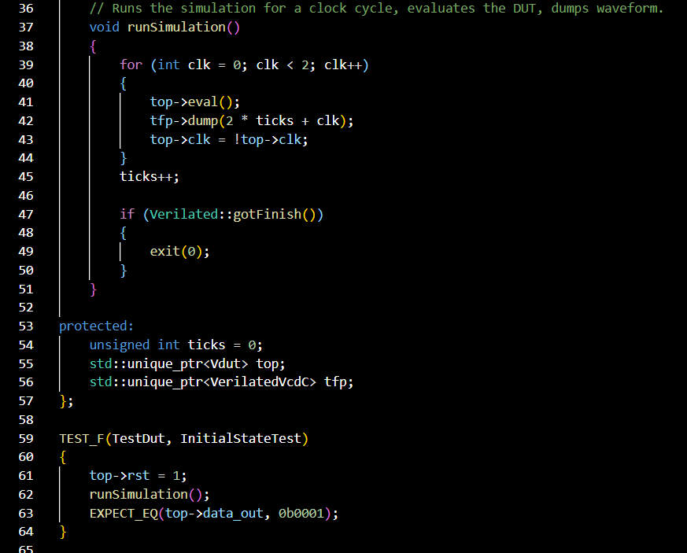
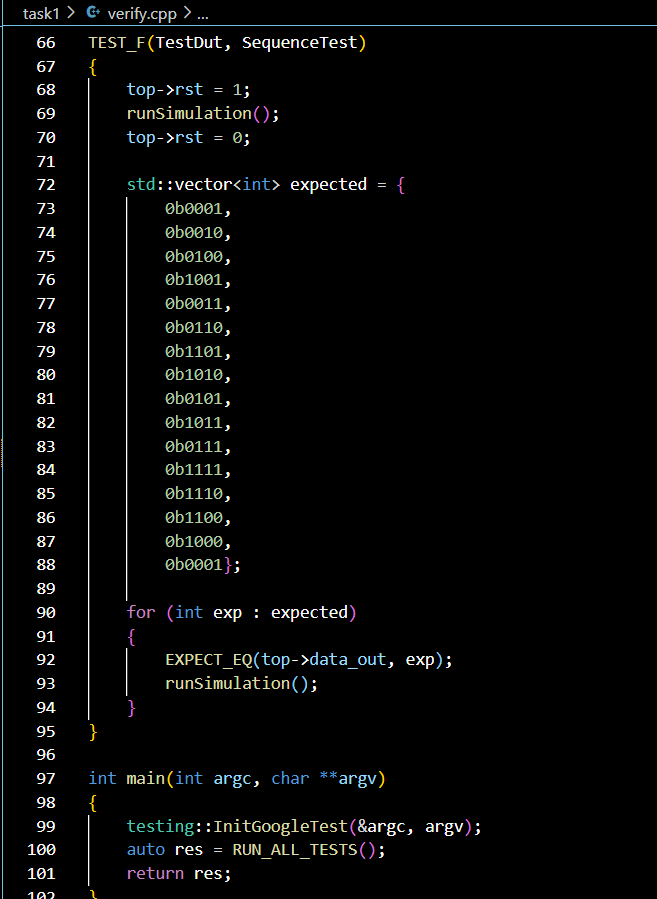

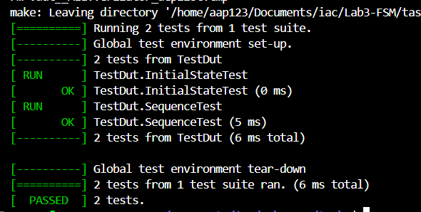

- Which allows to unit test the register to make sure it outputs the correct sequence

- The same thing applies for the 7 bit LFSR with primitive polynomial = 1 + X^3 + X^7 

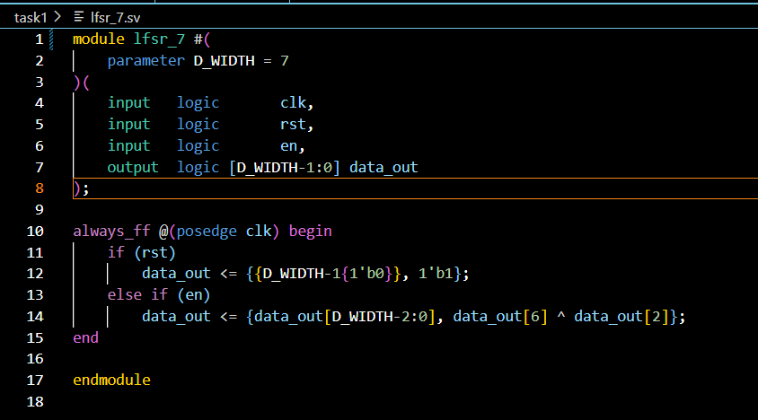

- This is how both tests are passed for the following tests

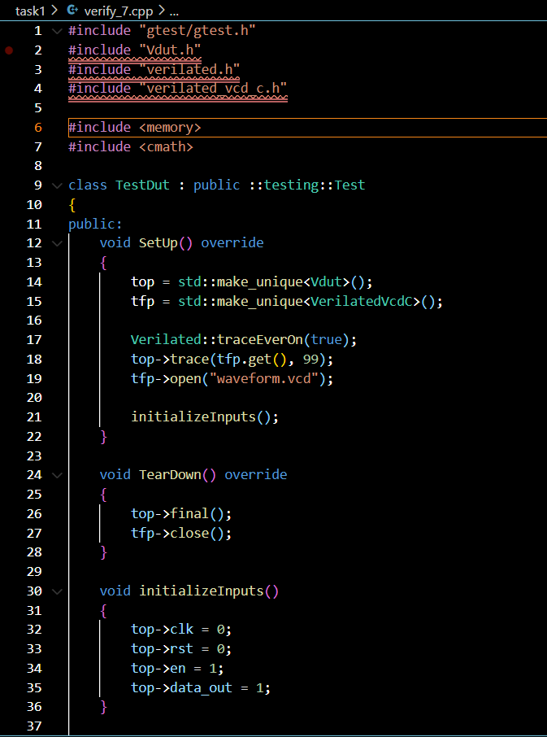
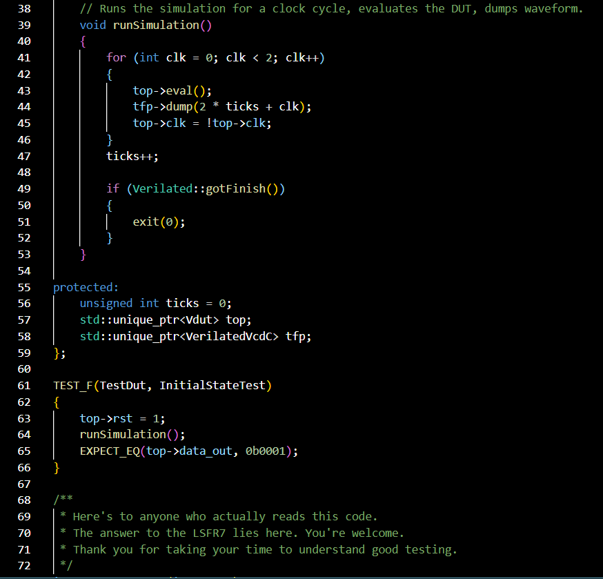
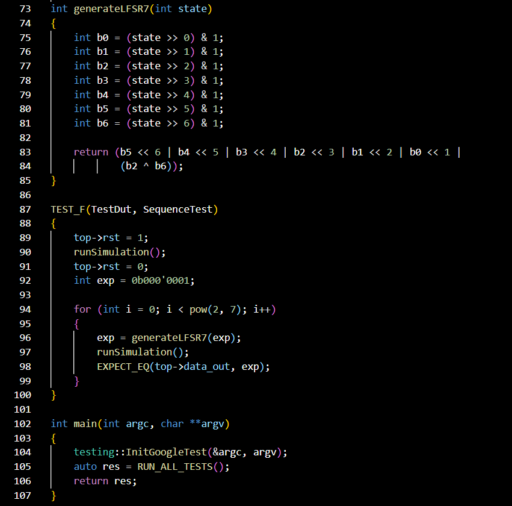

- The passing message:

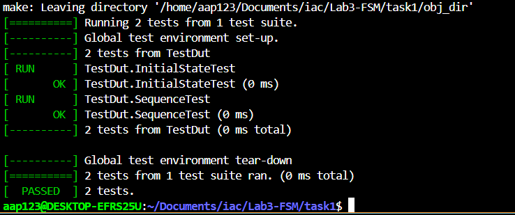