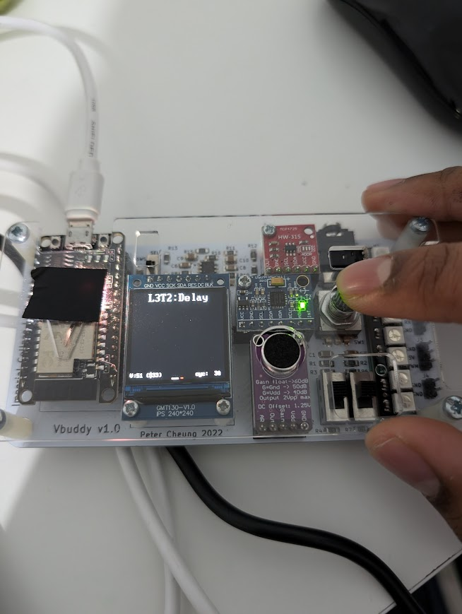
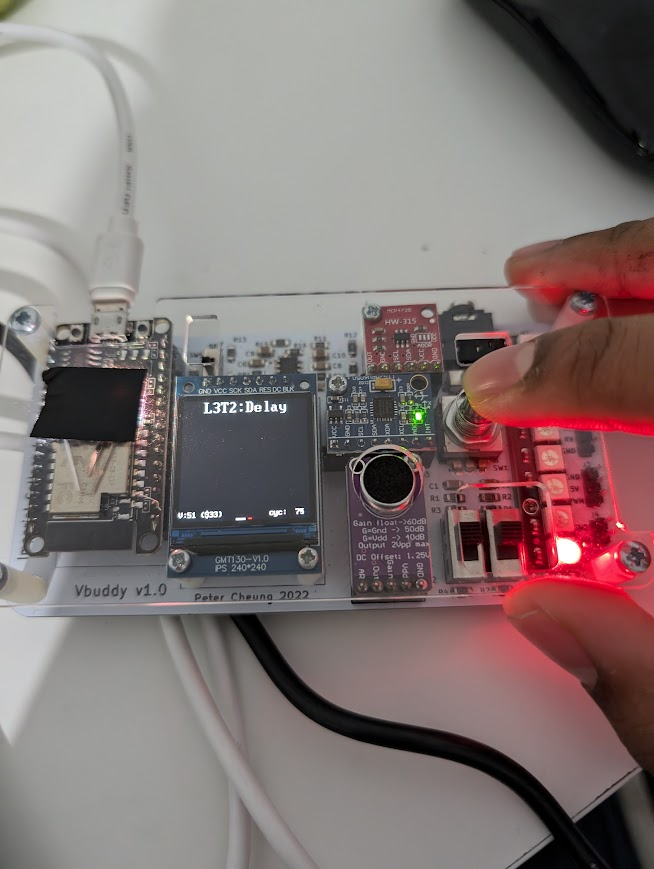
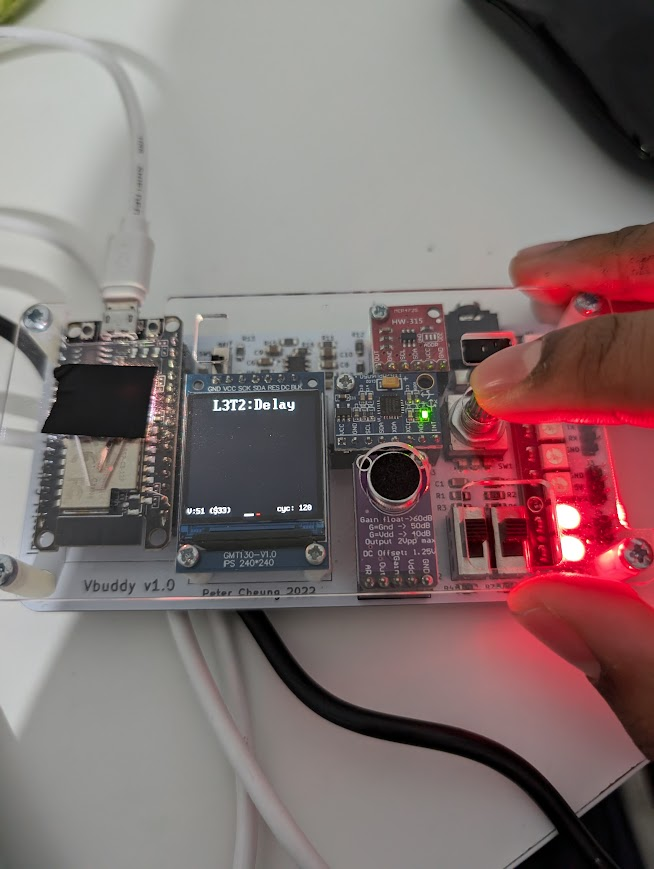
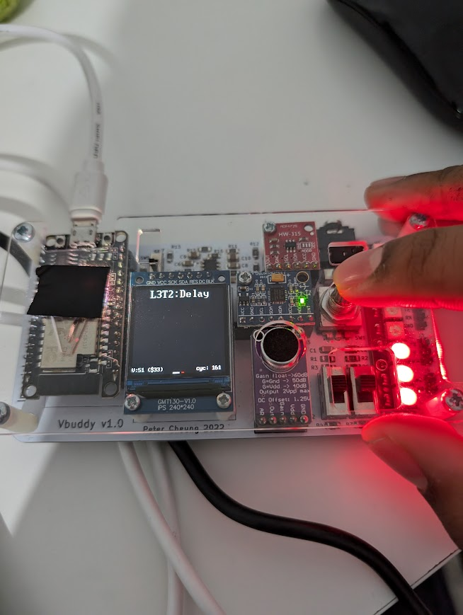
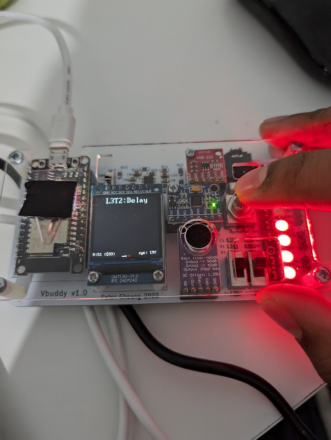
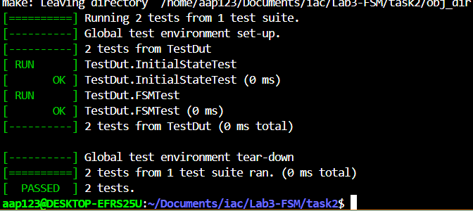
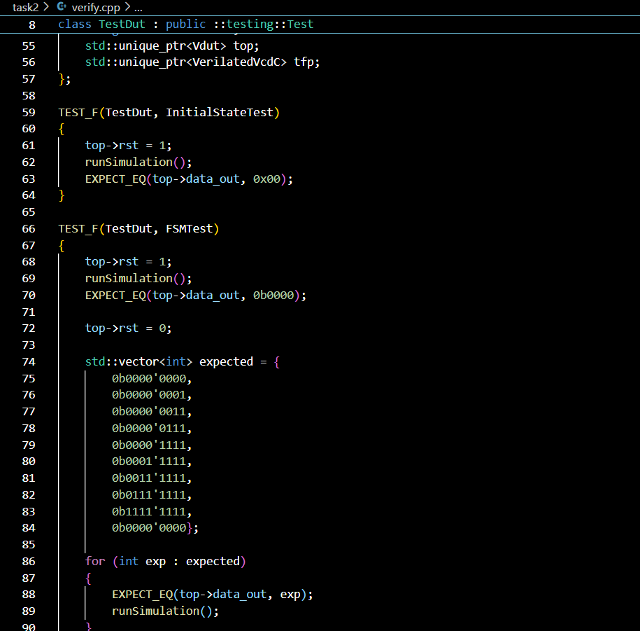
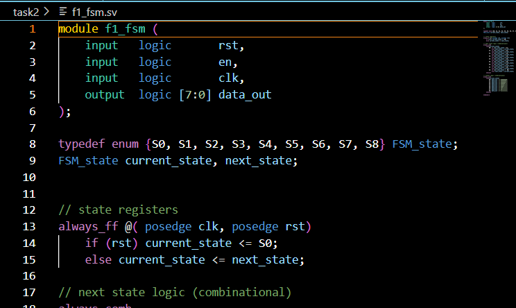
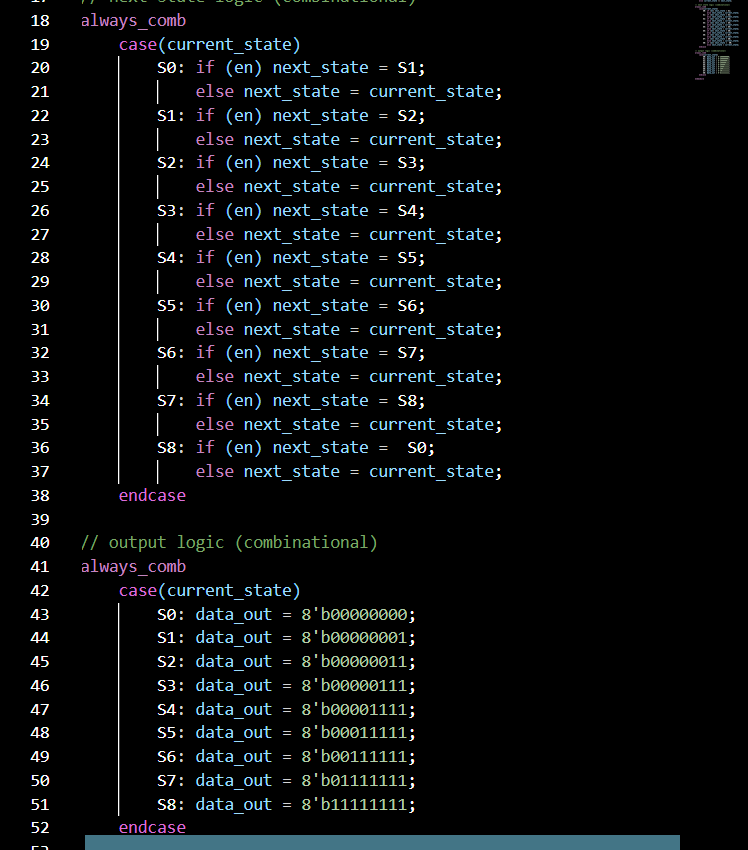
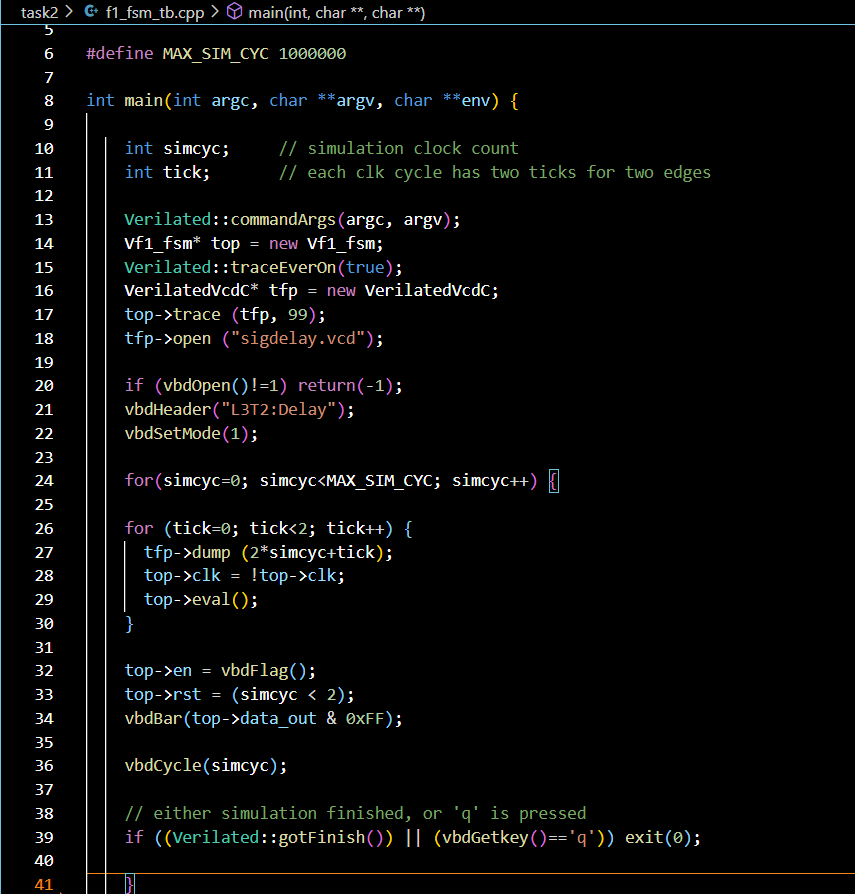

**Vbuddy Test**

- Images taken after each individual click of the dial

- This implements a FSM
- This FSM is a **Moore** machine because the output only depends on state

This shows the FSM passes the tests:

for the following tests in verify.cpp

**SV Files**

- FSM file

- The testbench is as follows

