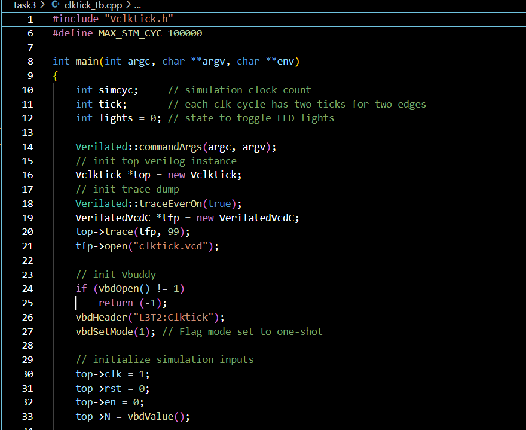
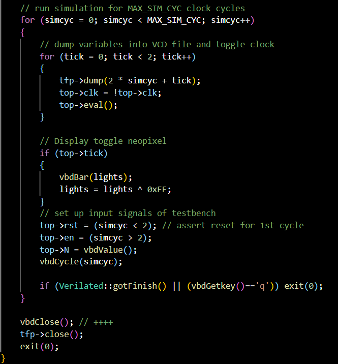
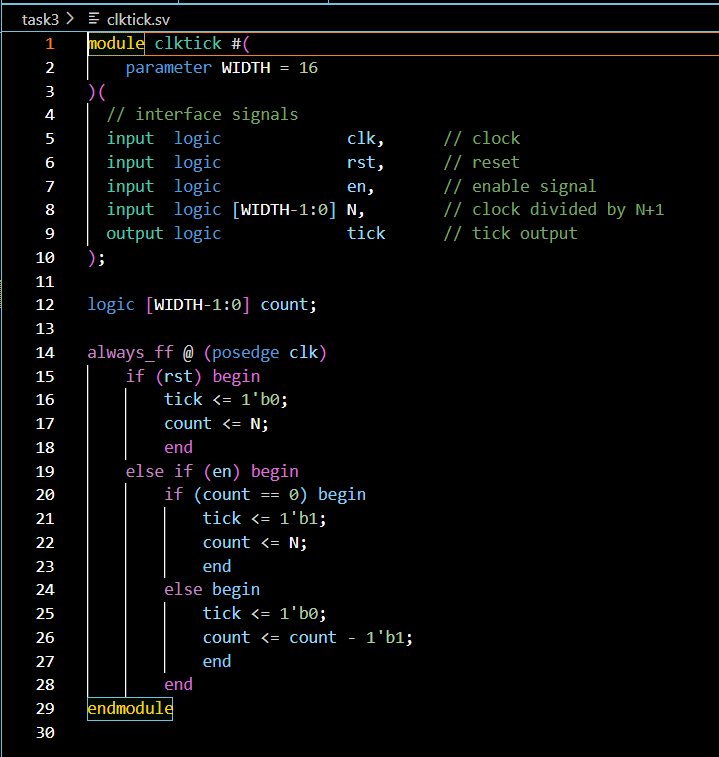

Create your design in this folder.

Don't forget to copy new version of vbuddy.cpp and your port configuration file vbuddy.cfg to this folder.

V = 48 this beats at around 60bpm

- For the following testbench setup:

- And the clocktick sv file looks as such:

