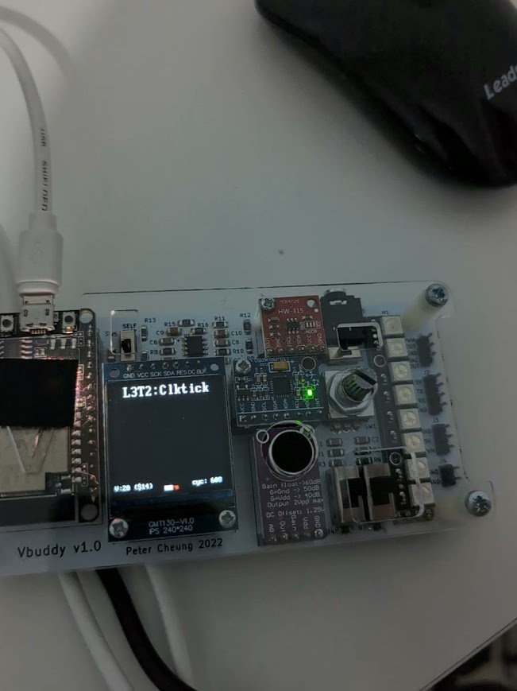
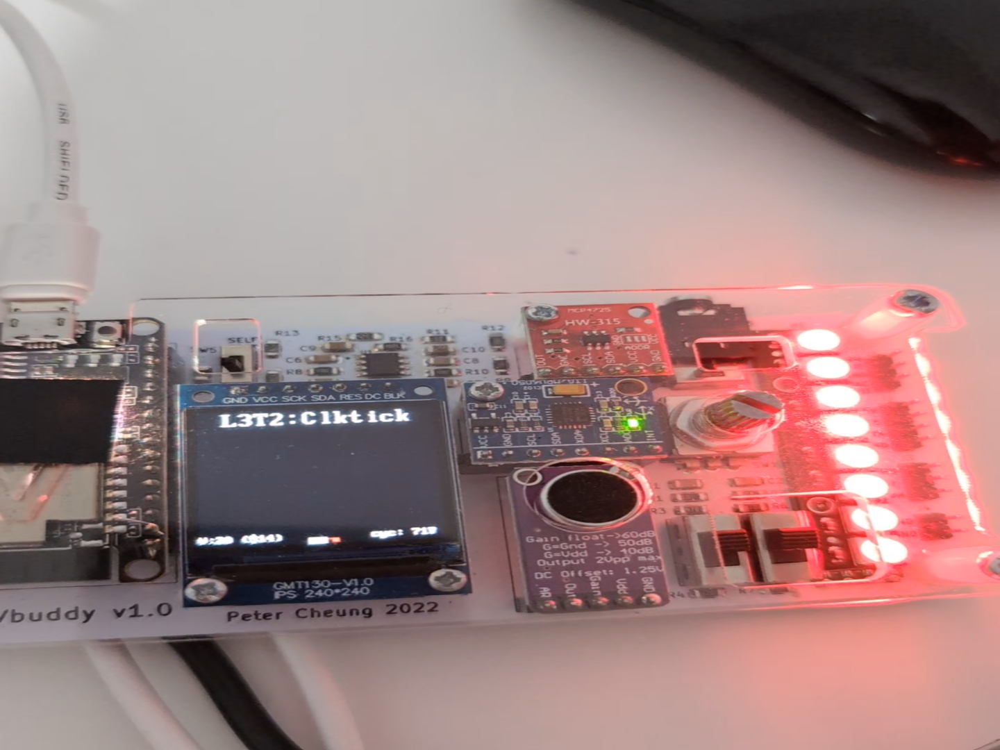

Create your design in this folder.

Don't forget to copy new version of vbuddy.cpp and your port configuration file vbuddy.cfg to this folder.

V = 48 this beats at around 60bpm

- Adjustable clock tick using the dial

**SV Files**

